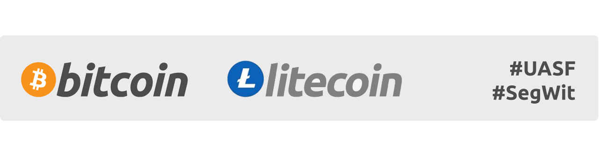
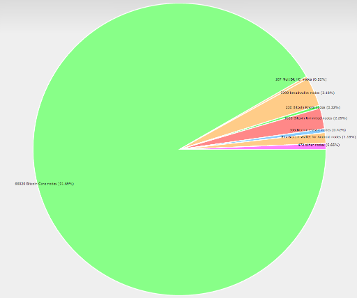
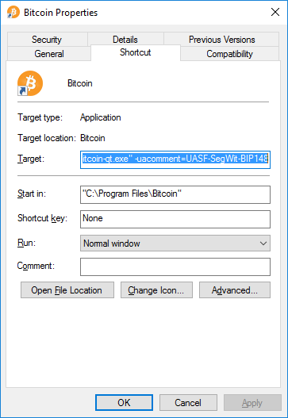

# BIP148 & UASF FAQ

### What is a UASF?
UASF stands for User Activated Soft Fork. It’s a mechanism where the activation time of a soft fork occurs on a specified date enforced by full nodes, a concept sometimes referred to as the economic majority. A UASF requires a lot of industry support and coordination, which is good practice for eventual hard forks which requires even more industry coordination.
In the past, a UASF was successfully carried out to activate the P2SH soft fork (BIP16). The UASF concept was combined with SegWit activation in the BIP148 proposal which can be found here: [github.com/bitcoin/bips/blob/master/bip-0148.mediawiki](https://github.com/bitcoin/bips/blob/master/bip-0148.mediawiki).

### UASF Signaling

*[sourced from uasf.saltylemon.org](http://uasf.saltylemon.org/)*

### What is a MASF?

MASF stands for Miner Activated Soft Fork. It’s a mechanism by which miners trigger activation of soft forks when a majority signals the readiness to upgrade. This allows for a faster activation time for the soft fork, leaving full nodes to upgrade at their leisure. This method is a tradeoff, because it puts trust in the hash power actually enforcing the new rules. If they do not, it can cause various invalid chains on the network. For example,  this was the case with BIP66, when hashpower indicated they had upgraded when in fact more than 50% had not. The other tradeoff is that the method allows a small number of hash power to veto activation of the soft fork for everyone on the network. Overall, if everyone cooperates, this method is very convenient and has been used to successfully activate multiple soft forks in the past such as BIP65 CLTV and BIP112 CSV.

### What is BIP148?

BIP148 is a UASF that is designed to cause the existing SegWit MASF deployment to cause activation in all existing SegWit capable node software (which currently is 80% of the network nodes).
How does BIP148 Work?
From August 1st, 2017, miners are required to signal readiness for SegWit by creating blocks with the version bit 1. This will cause all SegWit ready nodes, which make up over 80% of the network, to activate and begin enforcement.
Link for reference: [luke.dashjr.org/programs/bitcoin/files/charts/software.html](http://luke.dashjr.org/programs/bitcoin/files/charts/software.html). Miners must also check blocks prior to their own and ensure that they also signal for SegWit, and only build on those blocks.

### Who already supports UASF?

Company|Category|ANN.|
:--- | :--- | :---:
[Bitrefill](https://www.bitrefill.com) |Exchange| [proof](https://twitter.com/bitrefill/status/851818821946048512)
[Blocknomics](http://Blocknomics.co) |Explorer|  [proof](https://twitter.com/blockonomics_co/status/851770427529670658)
 [Bustabit](#) | Casino|[proof](https://www.reddit.com/r/Bitcoin/comments/63otrp/gregory_maxwell_major_asic_manufacturer_is/dfw02tg/)
[Coinkite](http://coinkite.com) | Hardware/Software | [proof](https://twitter.com/coinkite/status/851822761794260992)
[yogh.io](http://yogh.io) | Explorer| [proof](http://srv1.yogh.io/#json:getnetworkinfo)
[Trezor](https://trezor.io/) | Hardware Wallet | [proof](https://twitter.com/slushcz/status/851502735736418304)
[Samourai Wallet](https://samouraiwallet.com/) | Wallet| [proof](https://twitter.com/SamouraiWallet/status/851005717070917633)
[JoinMarket](https://github.com/JoinMarket-Org/joinmarket) | Mixer | [proof](https://twitter.com/joinmarket/status/851177740900368385)
[Freedom Node](https://freedomnode.com/) | ??? | [proof](https://freedomnode.com/bitcoin-core-support.txt)
[BitKong](https://bitkong.com/) | Casino | [proof](https://bitkong.com/segwit.txt)
[Bitfury](http://bitfury.com/) | Miner | [proof](https://news.bitcoin.com/bitfury-mines-block-signaling-uasf-segwit/)
[BitCoinReminder](https://bitcoinreminder.com/) | Tool | [proof](https://www.reddit.com/r/Bitcoin/comments/642n66/bitcoinremindercom_supports_bip148_and_a_fix/)

### Why BIP148 and not a direct flag day UASF for Segwit?

To be clear, BIP148 is a soft fork that requires miners to activate the existing SegWit deployment. This is not the standard for UASF because normally nodes would just begin enforcement on a given "flag day". However, almost 80% of the network has already upgraded to SegWit capable node software, in anticipation of miner triggered activation. A new "SegWit UASF" deployment would require all nodes to upgrade again which will take considerable time. For this reason, the shortened route to SegWit activation is to require blocks to signal for SegWit activation. In general, the block signalling mechanism is only supposed to be a coordination method that makes accelerated activation possible. In 2012, P2SH was activated by UASF with a simple flag day.

BIP148 was created to avoid having to force most users to upgrade their software. A vast majority of the nodes currently deployed are aware of the BIP9 signalling for SegWit. BIP148 is designed to motivate miners to signal for SegWit so that it is activated in a way that even users who are not running BIP148 will get the benefits of the activation of SegWit. For more information on the benefits of SegWit, please visit: [segwit.org](https://segwit.org).

### What do users need to do to enforce BIP148?

It is recommended that users do not update unless an economic majority commits to updating and users are aware of the risks and mitigations of a failed UASF deployment.

Users aware of the risks and who want to commit should use clients that enforce BIP148. Users that run full nodes would upgrade to one that enforces BIP148, or run their node behind an upgraded border node. Users of light clients (like mobile wallets) should check with each vendor to see their support for BIP148. We plan on documenting any public responses from wallets regarding BIP148 support.
Satoshi Portal Electrum Server for UASF: 158.69.102.114 port 50002

### What do miners need to do to enforce BIP148?

Miners should update their mining software to produce blocks with version bit 1 enabled prior to August 1st, 2017. Miners do not need to create SegWit blocks or make any other changes. After activation of SegWit, at a minimum, miners should also make sure they have a border node that filters out invalid blocks.

### What are the various scenarios that could happen from BIP148?

BIP148 requires support from the economic majority, particularly exchanges and wallets. If this does not occur, node software supporting BIP148 should not be run after August 1st as it will cause a chain split leading to the abandonment of BIP148.
There are strong economic incentives in the Bitcoin system for nodes to cooperate and remain in consensus to prevent chain splits. If the economic majority is signalling as of August 1st, miners have many incentives to follow along. Not following along would make it difficult to sell coins mined after August 1st as the blocks would not be accepted by the economic majority. Essentially, miners would be producing an altcoin not recognized by users and exchanges, making them less useful and in lower demand.

Some miners could opt to ignore the BIP148 rule and attempt to split the chain, but this would require a majority of miners who would be out of consensus from the rest of the economic majority.

If a majority of hash power follows BIP148, all nodes will follow the chain regardless of if they are running BIP148. Non-compliant blocks will be orphaned. All SegWit nodes will eventually activate SegWit.

If a minority of the hash power (under 51%) follows BIP148, nodes running BIP148 will be fine, but those not running BIP148 will be out of consensus with the rest of the economy. In this scenario, the more of the economy that runs BIP148, the better. Miners will find it difficult to sell their coins leading economically motivated miners to start enforcing BIP148.

### Why was the date of August 1, 2017 chosen?

Because BIP9 is time based, BIP148 needs to account for the possibility for some of the hash power to exit (eg. to mine another fork) which would make block intervals longer. The August 1st date allows for the economic majority to successfully activate SegWit. Theoretically, if the hashpower drops by up to 85%, it might take up to 13 weeks to complete an activation period. In this scenario, SegWit will still activate for all BIP148 compliant nodes.

### How can we show support for BIP148?

The best way to show support is to champion it through social media (Twitter, Facebook, etc...) and petition businesses and wallets to support it. Many users are also altering their node's user agent string to include BIP148.

To signal #BIP148 on Linux on your node before binaries are released:

`echo "uacomment=UASF-SegWit-BIP148" >> ~/.bitcoin/bitcoin.conf && bitcoin-cli stop && sleep 5 && bitcoind`

To signal #BIP148 on Windows, you can edit the shortcut for Bitcoin as follows:

_N.B. This will not enforce UASF on your node; it will only signal that you support it at this stage._

### Can BIP148 be cancelled?

Yes. In the event that the economic majority does not support BIP148, users should remove software that enforces BIP148. A flag day activation for SegWit would be the next logical steps and require coordination of the community, most likely towards the end of 2018.

### Does node count determine activation?

No. Users that decide to enforce the new rules will only follow blocks that conform to the existing rules which will in turn cause miners to activate SegWit. A UASF could be enforced by any number of economic nodes, although hash power may only choose to follow such rules if there was significant economic weight behind it.

### Will a UASF cause a chain split?

Soft forks rely on the economic incentives of the majority of miners and economic actors to reject invalid blocks based on the new ruleset. Since the new BIP148 rules are a stricter set than the old rules, any chain split means the chain with the old rules would be in danger of being wiped out. If the majority of miners enforce the new ruleset, all blocks produced that are invalid in the new ruleset will become orphaned. This economic incentive pushes miners to enforce the new rules. A UASF uses similar economic incentives. If the majority of hashing power enforces the new rules, chain splits remain temporary as with a solely miner enforced soft fork.

If the majority of hashpower does not enforce the rules, a chain split would occur. If there is a greater demand for the blocks produced by the BIP148 miners, then profit-driven miners would eventually flock to this chain, leading to the orphaning of the pre-soft-fork chain. If the demand is less for the soft-fork chain, then both chains may co-exist indefinitely.

### Is BIP148 a hard fork?

No, BIP148 isn’t a hard fork. A hard fork is often confused with a chain split. A hard fork is a type of chain split where the rules are loosened to allow previously disallowed blocks or transactions. A soft fork is a tightening of the rules. A soft fork will result in a converged chain if the majority of hashpower enforces its rules. For a more detailed explanation of types of forks and chain splits, see  [Chain Splits and Resolutions](https://medium.com/@alpalpalp/chain-splits-and-resolutions-d3398bddf4ab).

### I thought miners vote on proposals?

Miner activated soft forks are a convenient shortcut to activating soft forks because it allows the changes to activate before a significant portion of the economy upgrades. The signalling process is just to coordinate when a supermajority of hashrate has upgraded, nodes can then activate and begin enforcing the new rules. It was never intended to be a vote although it has an unintentional veto where a small amount of hash power can hold up the process.

Ultimately consensus is decided by the economic nodes in the ecosystem since they validate the chain and engage in economic activity. Ultimately even miner activated soft forks (MASF) are enforced by the nodes. The miners simply _trigger_ activation in the nodes.

A UASF forgoes the need for miner signalling because economic nodes are given more time to upgrade to the new rules and begin enforcing in the future. A UASF in no way impedes the operation of non-upgraded miners, nor disenfranchises them in any way. Miners always have the freedom to produce blocks following any rules they wish, but if they fall out of consensus with the economic nodes, their blocks will be rejected by the network.

### Can miners attack the chain in the event of a split?

Miners can always attack any chain at any time, but must do so by exerting real opportunity costs - they have to stop mining for profit. There are two main types of attacks. The first attack would be mining empty blocks. In the case of a chain split, this kind of attack would actually be beneficial - it would allow the chain to reach a difficulty retarget period faster. The second kind of attack is an active 51% attack on the chain. This type of attack requires a majority of hash power colluding to orphan valid blocks that have been mined. This kind of attack is always possible in Bitcoin, but can be defeated by changing the Proof of Work. These types of attacks are discouraged due to economic incentives- there typically is more to gain by cooperating than attacking.

### Won't blocks become very slow if there is a split?

Both sides of a chain split will produce slower than normal blocks until the difficulty period resets. This time will be dependent on the allocation of hash power. For example, if 25% of the hash power was left on a chain, it would take four times as long (8 weeks) to reach a retarget period. After this period, blocks would return to 10 minutes. Congestion would also likely result in higher fees, which would encourage more mining on this chain and faster blocks until equilibrium would be reached.

### How can I make sure I am protected in the event of a chain split?

This will depend on what type of wallet you use. In the case of a wallet using a centralized service's nodes, make sure the nodes their service uses are upgraded. In the case of something like Electrum, make sure the Electrum server you are using is upgraded. Ultimately, any non-fully validating wallet will derive information about balances from a fully validating node. You must take whatever steps you have to in order to ensure your wallet is connected to an upgraded BIP148 nodes.

### Where do I download software that enforces BIP148?

Successful User Activated Soft Forks require a strong consensus from the economy to be successful.  BIP148 also is subject to changes as it is reviewed, so some minor details may change before it is ready.  Until there is sufficient consensus, it is not advised to use any binaries that implement BIP148.  However, the BIP148 reference can be applied for testing and review purposes.  If you want to signal support, change your user agent comment to be "UASF-SegWit-BIP148", along with communicating with other Bitcoin users that you support BIP148.

---

*Contribute to this document here [github.com/OPUASF/UASF](https://github.com/OPUASF/UASF)*
