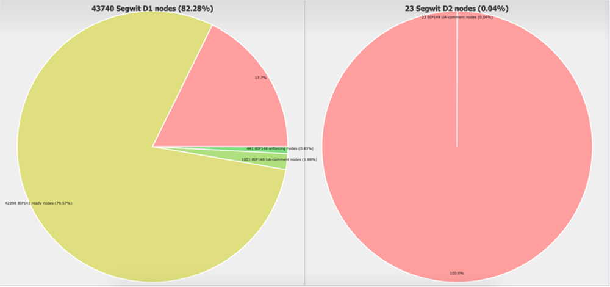

<div id="google_translate_element"></div><script type="text/javascript">
function googleTranslateElementInit() {
  new google.translate.TranslateElement({pageLanguage: 'en', layout: google.translate.TranslateElement.InlineLayout.SIMPLE}, 'google_translate_element');
}
</script><script type="text/javascript" src="//translate.google.com/translate_a/element.js?cb=googleTranslateElementInit"></script>
        

# BIP148 & UASF FAQ

### What is a UASF?
UASF stands for User Activated Soft Fork. It’s a mechanism where the activation time of a soft fork occurs on a specified date enforced by full nodes, a concept sometimes referred to as the economic majority. A UASF requires a lot of industry support and coordination, which is good practice for eventual hard forks which requires even more industry coordination.
In the past, a UASF was successfully carried out to activate the P2SH soft fork (BIP16). The UASF concept was combined with SegWit activation in the BIP148 proposal which can be found here: [github.com/bitcoin/bips/blob/master/bip-0148.mediawiki](https://github.com/bitcoin/bips/blob/master/bip-0148.mediawiki).

### UASF Signaling


*[sourced from uasf.saltylemon.org](http://uasf.saltylemon.org/)*


### What is a MASF?

MASF stands for Miner Activated Soft Fork. It’s a mechanism by which miners trigger activation of soft forks when a majority signals the readiness to upgrade. This allows for a faster activation time for the soft fork, leaving full nodes to upgrade at their leisure. This method is a tradeoff, because it puts trust in the hash power actually enforcing the new rules. If they do not, it can cause various invalid chains on the network. For example,  this was the case with BIP66, when hashpower indicated they had upgraded when in fact more than 50% had not. The other tradeoff is that the method allows a small number of hash power to veto activation of the soft fork for everyone on the network. Overall, if everyone cooperates, this method is very convenient and has been used to successfully activate multiple soft forks in the past such as BIP65 CLTV and BIP112 CSV.

### What is BIP148?

BIP148 is a UASF that is designed to cause the existing SegWit MASF deployment to cause activation in all existing SegWit capable node software (which currently is 80% of the network nodes).
How does BIP148 Work?
From August 1st, 2017, miners are required to signal readiness for SegWit by creating blocks with the version bit 1. This will cause all SegWit ready nodes, which make up over 80% of the network, to activate and begin enforcement.
Link for reference: [luke.dashjr.org/programs/bitcoin/files/charts/segwit.html](http://luke.dashjr.org/programs/bitcoin/files/charts/segwit.html). Miners must also check blocks prior to their own and ensure that they also signal for SegWit, and only build on those blocks.




### What are companies saying about BIP148?

Company|Category|Support Type|ANN.|
 :--- | :--- | :--- | :---:
 [Abra](https://www.goabra.com) |  Worldwide payments | Support | [proof](https://twitter.com/billbarhydt/status/851855874855391232)
 [Altana](https://play.google.com/store/apps/details?id=it.inbitcoin.altana) | Wallet | Support | [proof](https://twitter.com/inbitcoin/status/869489501059649536)
 [Bitcoin Embassy](https://bitcoinembassy.ca/) | Education | Support |[proof](https://twitter.com/francispouliot_/status/852554864144109569)
 [Bitcoin India](https://pool.bitcoin-india.org/) | Miner |Support | [proof](https://blockchain.info/tx/fae1c99536a93abd8e2ad84bd9563e3170343f21a0177c0232171756ed285edc)
 [BitCoinReminder](https://bitcoinreminder.com/)  | Tool | Support | [proof](https://www.reddit.com/r/Bitcoin/comments/642n66/bitcoinremindercom_supports_bip148_and_a_fix/)
 [Bitfury](http://bitfury.com/) | Miner | Support | [proof](https://news.bitcoin.com/bitfury-mines-block-signaling-uasf-segwit/)
 [BitKong](https://bitkong.com/) | Casino | Support | [proof](https://bitkong.com/segwit.txt)
 [Bitonic (BL3P)](https://bitonic.nl/) | Exchange | Support | [proof](https://bitonic.nl/en/news/138/our-position-on-scaling-proposals)
 [BitPay](https://bitpay.com) | Payment processor | No support | [proof](https://twitter.com/spair/status/852160130296762369)
 [Bitrated](https://twitter.com/bitrated/status/852414265134907392) | Identity & consumer protection | Support | [proof](https://twitter.com/bitrated/status/852414265134907392)
 [Bitrefill](https://www.bitrefill.com) |Exchange| Support | [proof](https://twitter.com/bitrefill/status/851818821946048512)
 [Bittylicious](https://bittylicious.com/) | Exchange |Support | [proof](https://twitter.com/Bittylicious_/status/852211177530810369)
 [Bitvest](https://bitvest.io/) | Gambling |Support | [proof](https://bitvest.io/segwit)
 [Blockchain Academy](https://block.academy/) | Education |Support | [proof](https://block.academy/consulting)
 [Blockonomics](https://www.blockonomics.co) |Explorer| Support|  [proof](https://twitter.com/blockonomics_co/status/851770427529670658)
 [Bustabit](https://www.bustabit.com/) | Casino|Interest|[proof](https://www.reddit.com/r/Bitcoin/comments/63otrp/gregory_maxwell_major_asic_manufacturer_is/dfw02tg/)
 [Bylls](https://bylls.com/) | Service | Support |[proof](https://twitter.com/francispouliot_/status/852554864144109569)
 [Ciphrex](https://ciphrex.com) | Wallet/Development Stack | Support | [proof](https://medium.com/@elombrozo/why-i-support-bip148-4b4c0a9feb4d)
 [CoinGate](https://coingate.com) | Payment Processor | Support | [proof](https://blog.coingate.com/2017/04/coingate-supports-segwit-and-uasf/)
 [Coinkite](http://coinkite.com) | Hardware/Software | Support| [proof](https://twitter.com/coinkite/status/851822761794260992)
 [Coinomi](https://coinomi.com/) | Multi-currency Wallet | Support| [proof](https://twitter.com/CoinomiWallet/status/852130791362637825)
 [Darknet Heroes League](https://www.deepdotweb.com/marketplace-directory/listing/darknet-heroes-league/) | Dark Net Marketplace | Support | [proof](https://www.reddit.com/r/Bitcoin/comments/6cna2s/notice_the_debate_is_now_only_about_the_way_of/dhwez9b/)
 [Échange de Montréal](https://www.echangedemontreal.com/) | Exchange | Support| [proof](https://twitter.com/echangedemtl/status/875781093261271040)
 [Electrum](https://electrum.org/) | Wallet | Support | [proof](https://twitter.com/electrumwallet/status/868845430947401729)
 [Freedom Node](https://freedomnode.com/) | Education | Support| [proof](https://freedomnode.com/bitcoin-core-support.txt)
 [inbitcoin](https://inbitcoin.it/) | Payment Processor | Ready | [proof](https://twitter.com/inbitcoin/status/869518776735289345)
 [JoinMarket](https://github.com/JoinMarket-Org/joinmarket) | Mixer | Support| [proof](https://twitter.com/joinmarket/status/851177740900368385)
 [LightningASIC](http://lightningasic.com/)| Miner |Support|[proof](https://twitter.com/lightningasic/status/865676297141313536)
 [MegaDice](https://www.megadice.com)| Gambling |Support|[proof](https://bitcointalk.org/index.php?topic=1828431.msg19541810#msg19541810)
 [Microsoft](http://microsoft.com)| Decentralized Identity dpt. |Support|[proof](https://twitter.com/csuwildcat/status/851832163792150528)
 [MojBitcoin](http://mojbitcoin.sk/)| ATM Operator | Support| [proof](https://twitter.com/MojBitcoin/status/866308792568479745)
 [Mycelium](http://mycelium.com)| Wallet | Ready| [proof](https://twitter.com/MyceliumCom/status/866295946698772480)
 [Prasos](https://prasos.fi) | Bitcoin broker | Support | [proof](https://twitter.com/prasosltd/status/852104011767566336)
 [Samourai Wallet](https://samouraiwallet.com/) | Wallet| Support| [proof](https://twitter.com/SamouraiWallet/status/851005717070917633)
 [Satoshi Counter](https://satoshicounter.com/) | Broker | Support |[proof](https://twitter.com/francispouliot_/status/852554864144109569)
 [Satoshi Portal](http://satoshiportal.com) | Financial services | Support|[proof](https://twitter.com/francispouliot_/status/850474196635439105)
 [Stampery Inc.](https://stampery.com) | Timestamping| Support |[proof](https://twitter.com/StamperyCo/status/852097157951873025)
 [Simple Bitcoin Wallet](https://btcontract.com/) | Wallet| Support |[proof](https://btcontract.com/#trusted-node)
 [Trezor](https://trezor.io/) | Hardware Wallet | Ready | [proof](https://twitter.com/slushcz/status/851502735736418304)
 [Trezor Web Wallet](https://wallet.trezor.io/) | Hardware Wallet | Ready, in beta | [proof](https://twitter.com/slushcz/status/882241787062087680), [implemented](https://beta-wallet.trezor.io)
 [Vaultoro](https://www.vaultoro.com) | Bitcoin & gold exchange | Support | [proof](https://twitter.com/Vaultoro/status/851370469018284034)
 [Walltime](https://walltime.info/) | Exchange | Support |[proof](https://pastebin.com/raw/FeNHqySX)
 [Yogh](http://yogh.io) | Explorer| Support |[proof](http://srv1.yogh.io/#json:getnetworkinfo)
 
 *[Add your business here by creating a pull request (must include public announcement link)](https://github.com/OPUASF/UASF/pulls)*

### Why BIP148 and not a direct flag day UASF for Segwit?

To be clear, BIP148 is a soft fork that requires miners to activate the existing SegWit deployment. This is not the standard for UASF because normally nodes would just begin enforcement on a given "flag day". However, almost 80% of the network has already upgraded to SegWit capable node software, in anticipation of miner triggered activation. A new "SegWit UASF" deployment would require all nodes to upgrade again which will take considerable time. For this reason, the shortened route to SegWit activation is to require blocks to signal for SegWit activation. In general, the block signalling mechanism is only supposed to be a coordination method that makes accelerated activation possible. In 2012, P2SH was activated by UASF with a simple flag day.

BIP148 was created to avoid having to force most users to upgrade their software. A vast majority of the nodes currently deployed are aware of the BIP9 signalling for SegWit. BIP148 is designed to motivate miners to signal for SegWit so that it is activated in a way that even users who are not running BIP148 will get the benefits of the activation of SegWit. For more information on the benefits of SegWit, please visit: [segwit.org](https://segwit.org).

### What do users need to do to enforce BIP148?

It is recommended that users do not update unless an economic majority commits to updating and users are aware of the risks and mitigations of a failed UASF deployment.

Users aware of the risks and who want to commit should use clients that enforce BIP148. Users that run full nodes would upgrade to one that enforces BIP148, or run their node behind an upgraded border node. Users of light clients (like mobile wallets) should check with each vendor to see their support for BIP148. We plan on documenting any public responses from wallets regarding BIP148 support.
Satoshi Portal Electrum Server for UASF: 158.69.102.114 port 50002

### What do miners need to do to enforce BIP148?

Prior to August 1st, 2017, miners should either:

1. Update their node software to a BIP148-enforcing version; or
1. Run a BIP148 border node to filter out invalid blocks, and update their existing mining software to produce blocks with version 1 bit enabled, to vote for Segwit activation

### What are the various scenarios that could happen from BIP148?

BIP148 requires support from the economic majority, particularly exchanges and wallets. If this does not occur, node software supporting BIP148 should not be run after August 1st as it will cause a chain split leading to the abandonment of BIP148.
There are strong economic incentives in the Bitcoin system for nodes to cooperate and remain in consensus to prevent chain splits. If the economic majority is signalling as of August 1st, miners have many incentives to follow along. Not following along would make it difficult to sell coins mined after August 1st as the blocks would not be accepted by the economic majority. Essentially, miners would be producing an altcoin not recognized by users and exchanges, making them less useful and in lower demand.

Some miners could opt to ignore the BIP148 rule and attempt to split the chain, but this would require a majority of miners who would be out of consensus from the rest of the economic majority.

If a majority of hash power follows BIP148, all nodes will follow the chain regardless of if they are running BIP148. Non-compliant blocks will be orphaned. All SegWit nodes will eventually activate SegWit.

If a minority of the hash power (under 51%) follows BIP148, nodes running BIP148 will be fine, but those not running BIP148 will be out of consensus with the rest of the economy. In this scenario, the more of the economy that runs BIP148, the better. Miners will find it difficult to sell their coins leading economically motivated miners to start enforcing BIP148.

### Why was the date of August 1, 2017 chosen?

Because BIP9 is time based, BIP148 needs to account for the possibility for some of the hash power to exit (eg. to mine another fork) which would make block intervals longer. The August 1st date allows for the economic majority to successfully activate SegWit. Theoretically, if the hashpower drops by up to 85%, it might take up to 13 weeks to complete an activation period. In this scenario, SegWit will still activate for all BIP148 compliant nodes.

### How can we show support for BIP148?

The best way to show support is to champion it through social media (Twitter, Facebook, etc...) and petition businesses and wallets to support it. Many users have already installed (or upgraded to) Bitcoin Core UASF BIP148 and this is best option for those who use own nodes to send and receive bitcoin. 

Users who cannot upgrade existing Bitcoin Core can change their node's user agent string to include BIP148, but such nodes will have to be upgraded to UASF BIP148 in order to be able to function on the BIP148 chain after August 1.


To signal #BIP148 on Linux on your node without a software change:

`echo "uacomment=UASF-SegWit-BIP148" >> ~/.bitcoin/bitcoin.conf && bitcoin-cli stop && sleep 5 && bitcoind`

To signal #BIP148 on Windows, you can edit the shortcut for Bitcoin as follows:


_N.B. This will not enforce UASF on your node; it will only signal that you support it at this stage. If you intend to use BIP148 to send and receive bitcoin after BIP148 activation, make sure to install Bitcoin Core UASF BIP148 prior to August 1, 2017._

### How can I compile BIP148 myself or download signed binaries?

Signed binaries can be downloaded [here](https://github.com/UASF/bitcoin/releases). To build from source, follow the instructions below.

First, install all necessary dependencies which are mentioned in the official Bitcoin build instructions:

OS | Link
------ | ------
OpenBSD | https://github.com/bitcoin/bitcoin/blob/master/doc/build-openbsx.md
OSX | https://github.com/bitcoin/bitcoin/blob/master/doc/build-osx.md
Unix | https://github.com/bitcoin/bitcoin/blob/master/doc/build-unix.md
Windows | https://github.com/bitcoin/bitcoin/blob/master/doc/build-windows.md

You can also use the gitian build system, which is a bit more complex, but generates deterministic builds which can then be verified by the signatures of some core developers:


Source | Link
------ | ------
Gitian | https://github.com/bitcoin/bitcoin/blob/master/doc/gitian-building.md
Signatures | https://github.com/UASF/gitian.sigs

The next step is to clone the UASF repository:

```
git clone https://github.com/UASF/bitcoin.git bitcoin_bip148
cd bitcoin_bip148
git checkout 0.14-BIP148
```

and then continue with the default compiling steps which are mentioned in the official build instructions:

```
./autogen.sh
./configure
make
make install # optional
```

Finished - you can run now your UASF BIP148 node.

### Are there any groups which I can join?

Yes. There are two slack channels on [slack.bitcoincore.org](http://slack.bitcoincore.org/):

* #UASF for general talk
* #UASF-SUPPORT for people who want to setup their BIP148 node

Feel free to join, we are always happy about people which are interested and would like to discuss with us!

### Can BIP148 be cancelled?

No. BIP148 will occur as long as any users support it. Many users have committed to running BIP148 regardless of consequences, therefore it cannot be cancelled.

### Does node count determine activation?

No. Users that decide to enforce the new rules will only follow blocks that conform to the existing rules which will in turn cause miners to activate SegWit. A UASF could be enforced by any number of economic nodes, although hash power may only choose to follow such rules if there was significant economic weight behind it.

### Will a UASF cause a chain split?

Soft forks rely on the economic incentives of the majority of miners and economic actors to reject invalid blocks based on the new ruleset. Since the new BIP148 rules are a stricter set than the old rules, any chain split means the chain with the old rules would be in danger of being wiped out. If the majority of miners enforce the new ruleset, all blocks produced that are invalid in the new ruleset will become orphaned. This economic incentive pushes miners to enforce the new rules. A UASF uses similar economic incentives. If the majority of hashing power enforces the new rules, chain splits remain temporary as with a solely miner enforced soft fork.

If the majority of hashpower does not enforce the rules, a chain split would occur. If there is a greater demand for the blocks produced by the BIP148 miners, then profit-driven miners would eventually flock to this chain, leading to the orphaning of the pre-soft-fork chain. If the demand is less for the soft-fork chain, then both chains may co-exist indefinitely.


### Is BIP148 a hard fork?

No, BIP148 isn’t a hard fork. A hard fork is often confused with a chain split. A hard fork is a type of chain split where the rules are loosened to allow previously disallowed blocks or transactions. A soft fork is a tightening of the rules. A soft fork will result in a converged chain if the majority of hashpower enforces its rules. For a more detailed explanation of types of forks and chain splits, see  [Chain Splits and Resolutions](https://medium.com/@alpalpalp/chain-splits-and-resolutions-d3398bddf4ab).

### I thought miners vote on proposals?

Miner activated soft forks are a convenient shortcut to activating soft forks because it allows the changes to activate before a significant portion of the economy upgrades. The signalling process is just to coordinate when a supermajority of hashrate has upgraded, nodes can then activate and begin enforcing the new rules. It was never intended to be a vote although it has an unintentional veto where a small amount of hash power can hold up the process.

Ultimately consensus is decided by the economic nodes in the ecosystem since they validate the chain and engage in economic activity. Ultimately even miner activated soft forks (MASF) are enforced by the nodes. The miners simply _trigger_ activation in the nodes.

A UASF forgoes the need for miner signalling because economic nodes are given more time to upgrade to the new rules and begin enforcing in the future. A UASF in no way impedes the operation of non-upgraded miners, nor disenfranchises them in any way. Miners always have the freedom to produce blocks following any rules they wish, but if they fall out of consensus with the economic nodes, their blocks will be rejected by the network.

### Can miners attack the chain in the event of a split?

Miners can always attack any chain at any time, but must do so by exerting real opportunity costs - they have to stop mining for profit. There are two main types of attacks. The first attack would be mining empty blocks. In the case of a chain split, this kind of attack would actually be beneficial - it would allow the chain to reach a difficulty retarget period faster. The second kind of attack is an active 51% attack on the chain. This type of attack requires a majority of hash power colluding to orphan valid blocks that have been mined. This kind of attack is always possible in Bitcoin, but can be defeated by changing the Proof of Work. These types of attacks are discouraged due to economic incentives- there typically is more to gain by cooperating than attacking.

### Won't blocks become very slow if there is a split?

Both sides of a chain split will produce slower than normal blocks until the difficulty period resets. This time will be dependent on the allocation of hash power. For example, if 25% of the hash power was left on a chain, it would take four times as long (8 weeks) to reach a retarget period. After this period, blocks would return to 10 minutes. Congestion would also likely result in higher fees, which would encourage more mining on this chain and faster blocks until equilibrium would be reached.

### How can I make sure I am protected in the event of a chain split?

This will depend on what type of wallet you use. In the case of a wallet using a centralized service's nodes, make sure the nodes their service uses are upgraded. In the case of something like Electrum, make sure the Electrum server you are using is upgraded. Ultimately, any non-fully validating wallet will derive information about balances from a fully validating node. You must take whatever steps you have to in order to ensure your wallet is connected to an upgraded BIP148 nodes.

### Where do I download software that enforces BIP148?

Successful User Activated Soft Forks require a strong consensus from the economy to be successful.  BIP148 also is subject to changes as it is reviewed, so some minor details may change before it is ready. Please check regulary to be up to date with the latest version.

You can find software here - be sure to [verify the signtures](https://www.reddit.com/r/Bitcoin/comments/6bkk3c/by_request_how_to_signal_uasf_a_guide_for_dummies/):

Operating system | Signatures
--------- | --------- 
win64-setup-unsigned.exe | [Signatures](https://github.com/UASF/gitian.sigs/tree/master/0.14.1-uasfsegwit0.3-win-unsigned)
win64.zip | [Signatures](https://github.com/UASF/gitian.sigs/tree/master/0.14.1-uasfsegwit0.3-win-unsigned)
win32-setup-unsigned.exe | [Signatures](https://github.com/UASF/gitian.sigs/tree/master/0.14.1-uasfsegwit0.3-win-unsigned)
win32.zip | [Signatures](https://github.com/UASF/gitian.sigs/tree/master/0.14.1-uasfsegwit0.3-win-unsigned)
Ubuntu | PPA provided by Luke-Jr
osx64.tar.gz | [Signatures](https://github.com/UASF/gitian.sigs/tree/master/0.14.1-uasfsegwit0.3-osx-unsigned)
osx-unsigned.dmg | [Signatures](https://github.com/UASF/gitian.sigs/tree/master/0.14.1-uasfsegwit0.3-osx-unsigned)
x86_64-linux-gnu.tar.gz | [Signatures](https://github.com/UASF/gitian.sigs/tree/master/0.14.1-uasfsegwit0.3-linux)
i686-pc-linux-gnu.tar.gz | [Signatures](https://github.com/UASF/gitian.sigs/tree/master/0.14.1-uasfsegwit0.3-linux)
aarch64-linux-gnu.tar.gz | [Signatures](https://github.com/UASF/gitian.sigs/tree/master/0.14.1-uasfsegwit0.3-linux)
arm-linux-gnueabihf.tar.gz | [Signatures](https://github.com/UASF/gitian.sigs/tree/master/0.14.1-uasfsegwit0.3-linux)
[Source Code](binaries/bitcoin-0.14.1-bip148_segwit0.3.tar.gz) | 


### What is BIP8?

BIP8 is a modification to BIP9.  BIP9 was the deployment mechanism for soft forks in the past that relied on miners signalling 95% readiness for activation.  It was successfully used to activate BIP65 (OP_CHECKLOCKTIMEVERIFY) and BIP68/BIP112/BIP113 (CHECKSEQUENCEVERIFY/Median Time).  BIP9 allows for upgrades to the system whenever a supermajority of miners are ready to enforce the changes, allowing for faster upgrades than a UASF may allow.  Every 2016 blocks, if 95% of those blocks signalled readiness for the proposed change, the soft fork enforcement would become mandatory in 2016 blocks.  Each change is given a fixed timeframe to achieve this activation, such that any change that is not activated may have its bit reused.  Proposals that do not achieve activation expire at the end of their time period, but may be renewed if there is sufficient interest.

BIP8 modifies BIP9 to automatically convert into a UASF at the end of its activation time.  This avoids the problem of a miner veto while still allowing miners to begin enforcing the rules sooner than a pure UASF would allow.  Once the final period completes after the timeout period, the rules become mandatory, regardless of signalling.

### Can BIP8 be applied to SegWit?

There was a proposal made by Shaolinfry to use BIP8 to deploy SegWit.  The proposal would set a new version bit for deployment after the current proposal would expire, and would lock-in in April 2018.  Miners would still be able to activate SegWit prior to the this date, but failure to activate would result in a mandatory lock-in.

Unlike BIP148, this proposal would not require miners to signal version bits for SegWit or create SegWit blocks. The only requirement for miners is to not build on top of blocks that are invalid under the SegWit rules.

---

*Contribute to this document here [github.com/OPUASF/UASF](https://github.com/OPUASF/UASF)*
